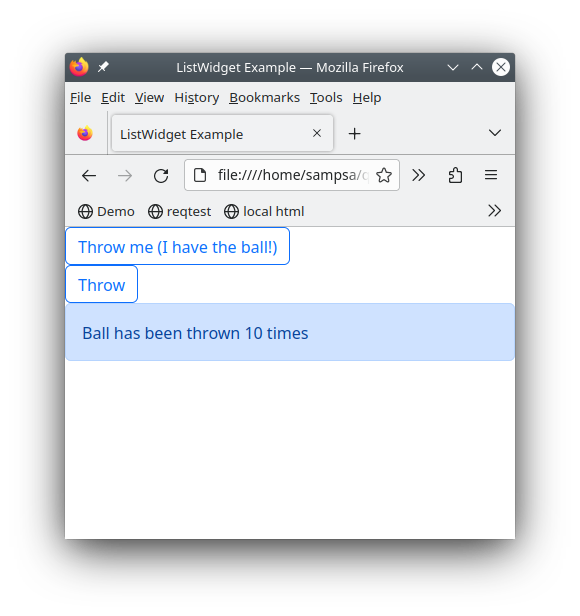

 
Qt-like Widgets and Signals
===========================

.. _ballgame:

Let's play ball
---------------

In CuteFront, there is only plain html and javascript.  
Javascript and html are in the same ``.html`` file, while each widget class is
in a separate ``.js`` file.

A code example tells more than thousand explanatory words, so let's get straight to it
with some javascript:

.. code:: javascript

    import { BallPlayer, BillBoard } from './ballplayer.js';
    var alex = new BallPlayer("alex");
    var bob = new BallPlayer("bob");
    var billboard = new BillBoard("billboard")

    // ball from alex to bob
    alex.signals.throw_ball.connect(
        bob.catch_ball_slot.bind(bob)
    )
    // ball from bob to alex
    bob.signals.throw_ball.connect(
        alex.catch_ball_slot.bind(alex)
    )
    // inform billboard about the game
    // alex throws
    alex.signals.throw_ball.connect(
        billboard.ball_throw_slot.bind(billboard)
    )
    // bob throws
    bob.signals.throw_ball.connect(
        billboard.ball_throw_slot.bind(billboard)
    )

    // give ball initially to alex
    alex.catch_ball_slot()

Here we have instantiated two widgets, namely, ``Bob`` 
and ``Alex``, from the same widget class ``BallPlayer``.  There's yet another widget
instantiated, ``billboard`` from the class ``Billboard`` that reports the ballgame
between alex and bob.

Widget classes are read from separate  ``.js`` files from a widget library.

Signals from Bob and Alex are connected to the slot of the other player and also
to the billboard so that it gets updated: the callback chains become obvious and easy 
to read, thanks to the signal/slot syntax.

The html part (in the same file), looks like this:

.. code:: html

    

    

    

Quite simple, right?  No templating languages or obscure ``onclick`` callbacks to- and fro
between html and javascript.

Only the basic layout is described by html, while all other complex / interactive stuff
is implemented by the widget code.  Note how we "hooked" into the ``
`` elements 
in the JS part by using their unique ``id``.

Here is an image of the working web-page:

You can also try it on-line in `here <https://elsampsa.github.io/cutefront/lib/base/ballplayer.html>`_

.. _state:

About the State
---------------

Before continuying, let's still comment about the "state" (the set of all variables) of the page: 

- Each widget from the ``BallPlayer`` class knows it's own state (has the ball or not).

- The widget from the ``Billboard`` class, similarly, knows only the relevant part of the state: how many times the ball has been thrown around.

In other words, the global state has been "partitioned" and cached into the widgets.  You can contrast this to, for example to Vue's "vuex"
and similar architectures, where the state variables become, in practice, global variables (like in 80's style programming).  Again, in Vue, 
it becomes even more nastier when those global variables are "reactive" and change sneakily other variables in the global state (and the page's behaviour).

*Let's emphasize the philosophy of handling the state in CuteFront:*

**Each widget caches it's own part of the global state**

Furthermore, signal/slot paradigm can naturally be represented as a graph, so let's do some ascii art:

.. code:: text

    BallPlayer
        sig: throw_ball  >------+-----+
        slot: catch_ball <--+   |     |
                            |   |     +---> Billboard
    BallPlayer              |   |     |
        sig: throw_ball  >--+---|-----+
        slot: catch_ball <------+

This feature is used in Qt's "Qt Studio", where you can create interactions by graphically drawing lines between widgets.  
We have the same potential with CuteFront.

A more complicated topic on the state is the "state history", i.e. moving forward and backward in history, using browser forward and backward
buttons.  You can read more about that in :ref:`State History <state_history>`.

.. _ballgame_code:

Anatomy of a Widget
-------------------

Let's take a look at the ``BallPlayer`` widget class:

.. code:: javascript

    class BallPlayer extends Widget {
        // A widget you can throw ball with
        // to another widget
        constructor(id) {
            super();
            this.id = id;
            this.createElement();
            this.createState();
        }
        // UP: signals
        createSignals() {
            this.signals.throw_ball = new Signal(); // sends the ball to another widget
        }
        // IN: slots
        catch_ball_slot() { // receive a ball
            this.log(-1, "catch_ball_slot")
            this.has_ball = true
            this.setBall()
        }
        createState() {
            if (this.element == null) {
                this.err("no html element")
                return
            }
            this.has_ball = false // the only state variable
            // initialize to not having a ball
        }
        createElement() {
            this.element = document.getElementById(this.id)
            if (this.element == null) {
                this.err("could not find element with id", this.id)
                return
            }
            this.element.innerHTML=`
            <button class="btn btn-outline-primary">Throw</button>
            `
            this.button=this.element.getElementsByTagName("button").item(0)
            this.button.onclick = (event) => {
                this.throwBall()
            }
        }
        throwBall() {
            if (!this.has_ball) {
                // we don't have the ball..
                return
            }
            this.has_ball = false
            this.setBall()
            this.signals.throw_ball.emit()
        }
        setBall() { // changes html element appearance according this.has_ball
            if (this.has_ball) {
                this.button.innerHTML=`Throw me (I have the ball!)`
                this.button.className="btn btn-outline-primary"
            }
            else {
                this.button.innerHTML=`Throw`
                this.button.className="btn btn-outline-primary"
            }
        }
        
    } // BallPlayer

All widgets define ``createSignals``, ``createState`` and ``createElement`` methods.

- ``createSignals`` defines the signals this widget emits.
- ``createState`` describes the internal state variables of the widget.
- ``createElement`` hooks into the html code and gets an element handle to the widget's html element.
  It then produces dynamically all the html code required by the widget and hooks into relevant DOM elements
  that are used by the widget (for more about ``createElement``, see :ref:`here <createelement>`).
- Slots methods have names ending in ``_slot``.  This is where the signals from other widgets are connected to.

To put it simply, slot methods change the internal state of the widget 
(created initially in ``createState``), and emit signals to other widgets.

Taking a look into ``createSignals`` and the ``_slot`` methods, **we can see at a single glance the API of the widget.**

Before going full throttle into creating your own interative pages and widgets,
please look at the :ref:`Creating Widgets <creating>` section for common techniques 
and pitfalls (in javascript, there are quite some).

